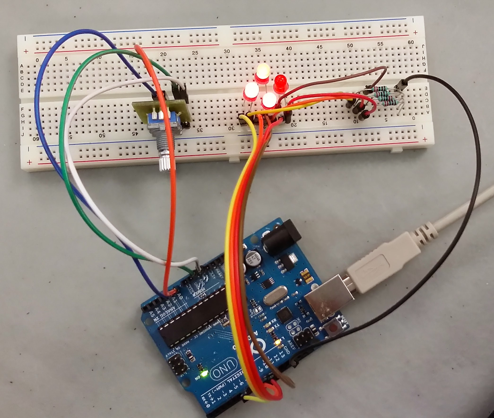

### What's that?

### How does it work?

1. The LEDs make a red spinner in a constant pace. 
2. The potentiometer lets you control the pace of the spinner. 
3. You're happy.

**Made with love.** 

(sorta)

